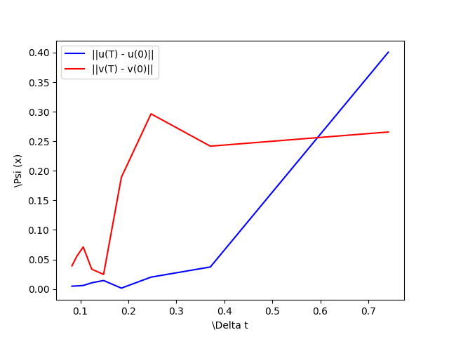

# FIRST MIPT LAB
## 1 __Exercise__ :

## __Solve__:
1. first k iterations, where k = 3:

$$
u_{i+1} - u_{i} = \Delta tv_{i} \\
v_{i+1} - v_{i} = -\Delta t u_i^3
$$

2. after that adams

$$
u_{i+1} - u_{i} = \frac{\Delta t}{12}(23 v_i - 16v_{i-1} + 5v_{i-2}) \\
v_{i+1} - v_{i} = \frac{\Delta t}{12}(23 u_i^3 - 16u_{i-1}^3 + 5u_{i-2}^3) 
$$

3. solution:

## __Standart Error__:
we need to draw graphs, which illustrates the 
$||f(T) - f(0)||$

## __Stability__:

## 2 __Exercise__:

## __Solve__:
To solve this equation, we need to know that 
**backward differentiation**

$$
\frac{3}{2}y_{l+1} -2y_l + \frac{1}{2}y_{l-1}=f_{l+1}*\Delta t 
$$

**First attempt**:

**Solution**:

