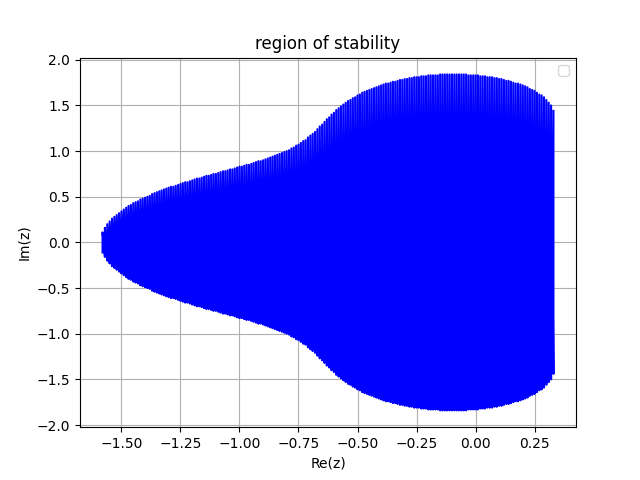
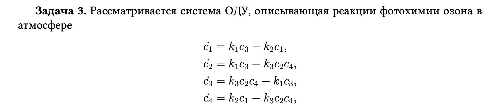
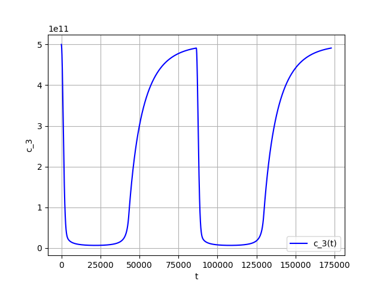
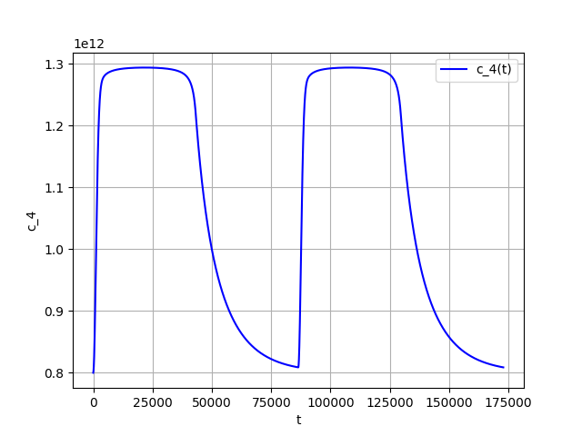

# FIRST MIPT LAB
## 1 __Exercise__ :

## __Solve__:
1. first k iterations, where k = 3:

$$
u_{i+1} - u_{i} = \Delta tv_{i} \\
v_{i+1} - v_{i} = -\Delta t u_i^3
$$

2. after that adams

$$
u_{i+1} - u_{i} = \frac{\Delta t}{12}(23 v_i - 16v_{i-1} + 5v_{i-2}) \\
v_{i+1} - v_{i} = \frac{\Delta t}{12}(23 u_i^3 - 16u_{i-1}^3 + 5u_{i-2}^3) 
$$

3. solution:

## __Standart Error__:
we need to draw graphs, which illustrates the 
$||f(T) - f(0)||$:

to compare the order of approximation, it is necessary to draw an error on a logarithmic scale, and draw a straight line with a logarithmic scale

to calculate the exact order of approximation, for each of the values u, v, we construct a dependence on the step of the discrepancy

## __Stability__:
The stability function for the explicit 3rd-order Adams method can be found using the error approximation method. This involves expanding the approximate solution y_n+1 and the exact solution y(t_n+1) in a Taylor series around the point t_n:
$$

y_{n+1} = y(t_{n+1}) = y(t_n + h) = y(t_n) + hy'(t_n) + 0.5h^2y”(t_n) + ...

$$

where y'(t_n) is the derivative of the function y(t) at t_n, y”(t_n) is the second derivative, and so on.

By substituting this expansion into the formula for the extrapolation of the explicit 3rd-order Adams method, we can express the error of the method as a Taylor series expansion. By comparing coefficients at the same powers of the step size h, we can determine the corresponding coefficients of the stability function.

Therefore, the stability function F(z) = 1 + z + 0.5*z^2 + 5/12*z^3 was found by analyzing the method error and approximating this error at different values of the step size h. And draw |F(z)|<= 1

## __Region of stability__:

## 2 __Exercise__:

## __Solve__:
To solve this equation, we need to know that 
**backward differentiation**

$$
\frac{3}{2}y_{l+1} -2y_l + \frac{1}{2}y_{l-1}=f_{l+1}*\Delta t 
$$

**First attempt**:

**Solution**:

after some changes:

**Solution C_1**:

**Solution C_2**:

**Solution C_3**:

**Solution C_4**:

