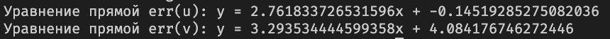
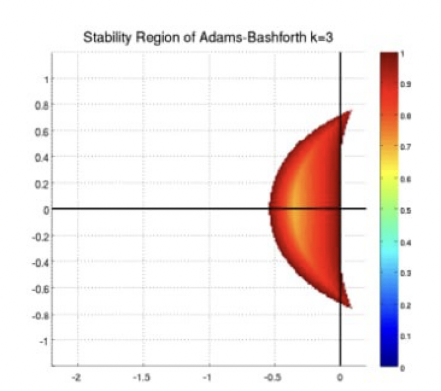

# FIRST MIPT LAB
## 1 __Exercise__ :

## __Solve__:
1. first k iterations, where k = 3:

$$
u_{i+1} - u_{i} = \Delta tv_{i} \\
v_{i+1} - v_{i} = -\Delta t u_i^3
$$

2. after that adams

$$
u_{i+1} - u_{i} = \frac{\Delta t}{12}(23 v_i - 16v_{i-1} + 5v_{i-2}) \\
v_{i+1} - v_{i} = \frac{\Delta t}{12}(23 u_i^3 - 16u_{i-1}^3 + 5u_{i-2}^3) 
$$

3. solution:

## __Standart Error__:
we need to draw graphs, which illustrates the 
$||f(T) - f(0)||$:

to compare the order of approximation, it is necessary to draw an error on a logarithmic scale, and draw a straight line with a logarithmic scale

to calculate the exact order of approximation, for each of the values u, v, we construct a dependence on the step of the discrepancy

from this we can conclude that the **order of approximation** of __our scheme__ is 3

## __Stability__:
For multistep methods such as Adams methods or prediction-correction methods, the stability domain can be represented in the complex plane as the domain within which all the roots of the characteristic equation corresponding to the method lie. If all the roots of the characteristic equation are inside the stability domain, then the method is considered stable.

let's consider our scheme and apply the canonical equation for this:

$$
\frac{dy}{dx}=ky
$$

substituting it into the original scheme, we obtain an equation depending on z, where $ z = k \Delta t $:

$$
\lambda ^3 + \frac{16}{12}\lambda z - \lambda^2(1+\frac{23}{12}z)=0
$$

for the rest of the reasoning, see the pictures below (wolframalpha, maple):

if we compare the obtained area of stability with the result from the well-known literature, we can find many similarities, but this inaccuracy is due to the number of points that I have selected, there are only 1000

## 2 __Exercise__:

## __Solve__:
To solve this equation, we need to know that 
**backward differentiation**

$$
\frac{3}{2}y_{l+1} -2y_l + \frac{1}{2}y_{l-1}=f_{l+1}*\Delta t 
$$

**First attempt**:

**Solution**:

after some changes:

**Solution C_1**:

**Solution C_2**:

**Solution C_3**:

**Solution C_4**:

to set the maximum step for the explicit Euler method for this problem, I wrote the functions that you can find in the code, and the answer is that the maximum step is 17.28

